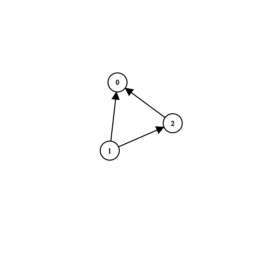

#### [1462. 课程安排 IV](https://leetcode-cn.com/problems/course-schedule-iv/)

难度中等21

你总共需要上 `n` 门课，课程编号依次为 `0` 到 `n-1` 。

有的课会有直接的先修课程，比如如果想上课程 0 ，你必须先上课程 1 ，那么会以 `[1,0]` 数对的形式给出先修课程数对。

给你课程总数 `n` 和一个直接先修课程数对列表 `prerequisite` 和一个查询对列表 `queries` 。

对于每个查询对 `queries[i]` ，请判断 `queries[i][0]` 是否是 `queries[i][1]` 的先修课程。

请返回一个布尔值列表，列表中每个元素依次分别对应 `queries` 每个查询对的判断结果。

**注意：**如果课程 **a** 是课程 **b** 的先修课程且课程 **b** 是课程 **c** 的先修课程，那么课程 **a** 也是课程 **c** 的先修课程。

 

**示例 1：**


```
输入：n = 2, prerequisites = [[1,0]], queries = [[0,1],[1,0]]
输出：[false,true]
解释：课程 0 不是课程 1 的先修课程，但课程 1 是课程 0 的先修课程。
```

**示例 2：**

```
输入：n = 2, prerequisites = [], queries = [[1,0],[0,1]]
输出：[false,false]
解释：没有先修课程对，所以每门课程之间是独立的。
```

**示例 3：**



```
输入：n = 3, prerequisites = [[1,2],[1,0],[2,0]], queries = [[1,0],[1,2]]
输出：[true,true]
```

**示例 4：**

```
输入：n = 3, prerequisites = [[1,0],[2,0]], queries = [[0,1],[2,0]]
输出：[false,true]
```

**示例 5：**

```
输入：n = 5, prerequisites = [[0,1],[1,2],[2,3],[3,4]], queries = [[0,4],[4,0],[1,3],[3,0]]
输出：[true,false,true,false]
```

 

**提示：**

- `2 <= n <= 100`
- `0 <= prerequisite.length <= (n * (n - 1) / 2)`
- `0 <= prerequisite[i][0], prerequisite[i][1] < n`
- `prerequisite[i][0] != prerequisite[i][1]`
- 先修课程图中没有环。
- 先修课程图中没有重复的边。
- `1 <= queries.length <= 10^4`
- `queries[i][0] != queries[i][1]`

通过次数2,526

提交次数6,471